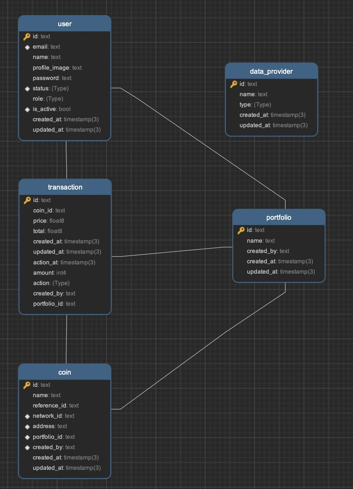

<a name="readme-top"></a>

This is a Kryptodian Profolio project.

## Getting Started
## Prerequisites
Make sure you have installed all of the following prerequisites on your development machine:
* Git - [Download & Install Git](https://git-scm.com/downloads). OSX and Linux machines typically have this already installed.
* Node.js - [Download & Install Node.js](https://nodejs.org/en/download/) and the npm package manager. If you encounter any problems, you can also use this [GitHub Gist](https://gist.github.com/isaacs/579814) to install Node.js.
* Node.js 20.* and above
* Yarn - [Download & Install yarn][https://classic.yarnpkg.com/lang/en/docs/install/#mac-stable]. Yarn package manager.

### A typical top-level directory layout


    .
    ├── ...
    ├── kryptodian                    # Your project directory
    │   ├── kryptodian-frontend         # clone and installation frontend
    │   ├────── .env                         # Your Frontend environments
    │   ├── kryptodian-backend         # clone and installation backend
    │   ├────── .env                         # Your Backend environments
    │   └── docker-compose.yml          # docker file for start web application
    └── ...

## Clone Project

```bash
$ mkdir kryptodian
$ cd kryptodian
$ git clone https://github.com/Pongsakorn2341/kryptodian-frontend.git
$ git clone https://github.com/Pongsakorn2341/kryptodian-backend.git
```

## Diagram


## Docker Compose file

```yml
version: "3"
services:
  frontend:
    build:
      context: kryptodian-frontend/
    ports:
      - "3000:3000"
    depends_on:
      - backend
      - db
    networks:
      - app-network

  backend:
    build:
      context: kryptodian-backend/
    ports:
      - "4444:4444"
    depends_on:
      db:
        condition: service_healthy
    networks:
      - app-network
    restart: always

  db:
    image: postgres:13
    container_name: kryptodian_postgres_db
    environment:
      POSTGRES_USER: tottee-user                        # Your database username
      POSTGRES_PASSWORD: tottee-password                # Your database password
      POSTGRES_DB: develop                              # Your database name
    volumes:
      - pg_db_data:/var/lib/postgresql/kryptodian-data
    ports:
      - "5432:5432"
    networks:
      - app-network
    user: "1000:1000"
    healthcheck:
      test: ["CMD-SHELL", "pg_isready -U tottee-user"]  # Must be same value as database username
      interval: 10s
      timeout: 50s
      retries: 5

networks:
  app-network:
    driver: bridge

volumes:
  pg_db_data:

```

## ENV Usage
Add your application configuration to your .env file in the root of kryptodian-frontend project:
```
NEXTAUTH_URL=                   # Your application url eg. http://localhost:3000
NEXTAUTH_SECRET=                # Your secret or can get from command `openssl rand -base64 32`
NEXT_PUBLIC_BACKEND_URL=        # Your backend url is started at eg. http://localhost:4444
```


## Quick Install
Once you've downloaded the boilerplate and installed all the prerequisites, you're just a few steps away from starting to develop your MEAN application.

The boilerplate comes pre-bundled with a `package.json` and `bower.json` files that contain the list of modules you need to start your application.

To install the dependencies, run this in the application folder from the command-line:

```bash
$ yarn install
```

This command does a few things:
* First it will install the dependencies needed for the application to run.
* If you're running in a development environment, it will then also install development dependencies needed for testing and running your application.
* When the npm packages install process is over, npm will initiate a bower install command to install all the front-end modules needed for the application
* To update these packages later on, just run `yarn install`

## Running Your Application

Run your application using npm:

```bash
$ yarn build
$ yarn start
```

Your application should run on port 3000 with the *development* environment configuration, so in your browser just go to [http://localhost:3000](http://localhost:3000)

That's it! Your application should be running. To proceed with your development, check the other sections in this documentation.
If you encounter any problems, try the Troubleshooting section.


## Contact

Pongsakorn Parsoppornpiboon - pongsakorn.psb@gmail.com
Github : https://github.com/Pongsakorn2341

<p align="right">(<a href="#readme-top">back to top</a>)</p>